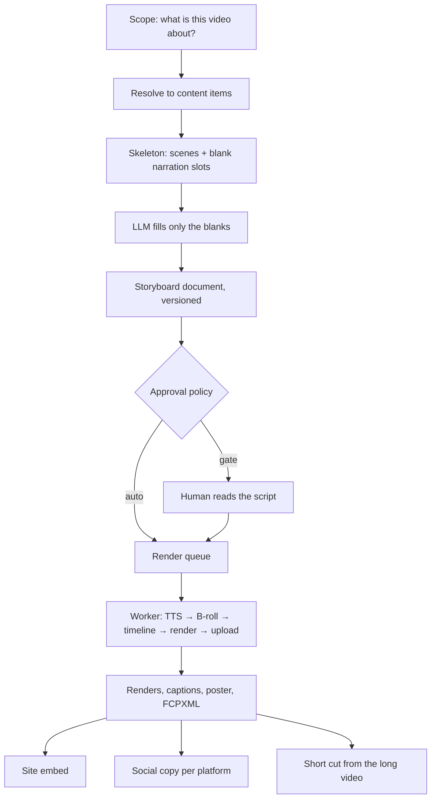
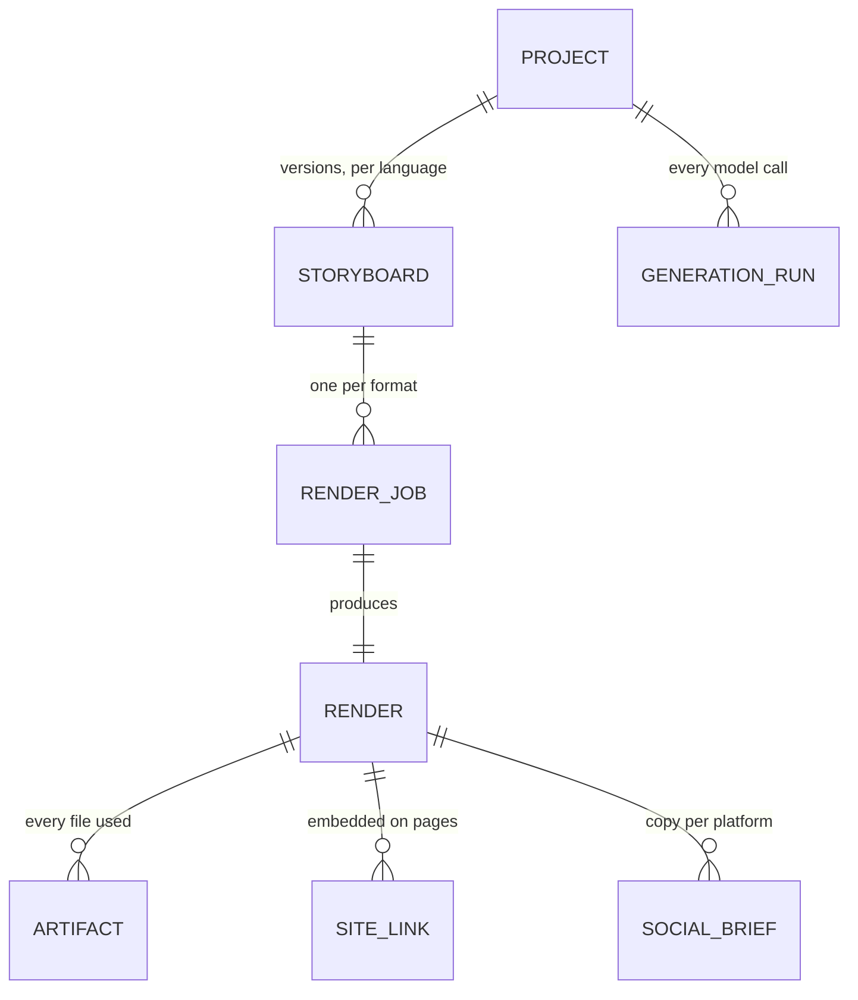

# Building an automated video pipeline

How to turn a content database into published video without a human touching a timeline — written
as a playbook, with Video Studio as the worked example. Most of it transfers to any project that
generates media from structured data.

The decisions matter more than the code. Where a choice cost time to get right, the measurement
that settled it is included, because those are the parts that do not survive being re-derived from
scratch.

---

## The one rule everything else follows

> **Everything on screen is built deterministically from the database. Only the spoken explanation
> is written by the model.**

A hallucinated blog paragraph is embarrassing. A hallucinated kanji reading burned into a teaching
video is actively harmful, and it ships to YouTube where it cannot be quietly edited.

So the skeleton builder fills every visual field and every Japanese narration segment straight from
`vocabulary.reading`, `kanji.onyomi`, `examples.sentence_ja`. The model receives a list of blank
segment ids and writes English or Hindi prose into them. **It never sees a slot where it could
invent Japanese.**

This single constraint explains most of the architecture below: why generation is slot-filling
rather than free-form, why regenerating a scene touches only narration, why hand-inserted scenes
are restricted to commentary types, and why a "wrong" video is nearly always a data problem rather
than a model problem.

**Transferable version:** decide which parts of your output are facts and which are prose. Generate
the facts; let the model write only the connective tissue. Then a bad generation is a bad sentence,
not a bad fact.

---

## The pipeline



Each stage is a table, so a failure at any point is inspectable rather than lost in a log.

---

## 1. Scope — deciding what a video is about

Seven scope kinds, each resolving to a list of content items:

| Scope | Resolves to |
|---|---|
| `content_item` | one post |
| `content_batch` | a query — type, level, count — or an explicit id list |
| `topic` | a free-text theme, confirmed into an id list |
| `curriculum_lesson` / `_submodule` / `_module` / `_level` | every lesson beneath that node |

**Lesson worth stealing: make the scope a stored reference, not a snapshot.** `scope_ref` is JSONB
holding `{contentType, jlptLevel, limit}` or `{postIds: [...]}`. The items are re-resolved at
generation time, so content edited between creating a project and generating it is picked up.

**And then contradict yourself deliberately:** the *storyboard* stores a `content_snapshot` of what
it was actually built from. The scope is live; the generated artefact is frozen. Without the
snapshot you cannot answer "which words are in this video" a month later.

### Free-text topics need two halves, and both are wrong sometimes

Turning "birds in Japanese" into a video taught three things:

1. **Substring matching is unusable.** Measured on this database: `ILIKE '%cat%'` returns 96 rows
   (category, indicate, educate); `%one%` returns 240 (money, phone, alone). Word-boundary regex
   (`~* '\ycat\y'`) cuts those to 2 and 114.
2. **The LLM must expand the topic first.** "birds" alone matches almost nothing, because the
   database holds "sparrow", "crow", "chicken". Expansion is the difference between 3 candidates
   and a usable set, and costs ~200 tokens.
3. **Neither half is trustworthy.** An expanded bird set still matched 俯瞰 *bird's-eye view* and
   縮める *to duck (one's head)*. So a human confirm step is **structural, not polish**.

Whatever the model invents to fill gaps becomes a **draft row in the content database**, not a
value living only inside one video. It then enters the normal review pipeline, is reused by the
next video, and earns its own page.

### Rank for your audience, not alphabetically

`ORDER BY jlpt_level` put N1 first, so a beginner-focused site returned the four most obscure kanji
for "birds". Ordering pedagogically — N5, N4, N3, N2, N1 — then by definition length turned
"numbers" into 40 matches all at N5 starting 一 二 三.

**Transferable:** any ranking over a level, tier or difficulty field almost certainly needs an
explicit `CASE`, and the default lexical order is silently wrong in a way nobody reports.

---

## 2. Script generation

### Skeleton and slots

`buildSkeleton(snapshot, config)` produces the complete scene list with every visual populated and
narration segments left blank, each carrying an id, a hint, and a **word budget**. The model is sent
the blanks and returns `{slotId: "text"}`.

Benefits that fall out of this shape:

- The video's structure is testable without spending a token.
- A scene can be regenerated alone — filter the blanks to one scene.
- The prompt is small: hints, not the whole content payload.
- The model cannot restructure the video, only speak within it.

### Word budgets must be computed, not requested

The first version passed a target duration as prose ("about 60 seconds") while per-slot word limits
were hardcoded constants. Nothing connected the two. Both projects asked for 60 seconds; one
produced 121s and the other would have produced 6–7 minutes.

The fix: **measure how fast the voice actually speaks**, then derive the word count from the time
budget.

| | chars/sec | how |
|---|---|---|
| English (en-US) | 16.30 | 15 sentences, 1120 chars, 68.7s |
| Hindi (Devanagari) | 14.29 | 15 sentences, 1001 chars, 70.1s |
| Hinglish (romanised, en-IN) | 15.45 | 15 sentences, 1144 chars, 74.1s |
| Japanese @0.9× | 4.91 | 15 sentences, 306 chars, 62.3s |

**Measure sentences, not clips.** An earlier set of numbers was pooled over real cached clips, most
of which were single words — the Japanese set was 30 clips totalling 169 characters. A TTS clip
carries ~0.36s of fixed onset and decay regardless of length, so `"cat"` alone measures 4.43 c/s
where a sentence measures 16.36. Pooling short clips understates the rate for the sentences
narration actually contains, and the estimate ran long.

Validated against four real renders with known durations, predicting from text alone: worst error
fell from **19.6% to 7.4%**. The worst case beforehand was the language whose rate had been
guessed rather than measured.

**Transferable:** if your system estimates duration, size or cost, find a ground truth to check it
against and state the error. An unvalidated estimate is a guess with a decimal point.

### Chunking, and the ceiling it runs into

One call per video works until a scope is large. A whole JLPT level is 2,820 narration slots — no
single response can carry it, and a truncated response silently drops slots into a shorter video.

Batching fixes correctness: split on **scene boundaries** (never mid-scene, since a scene's
segments are written to follow each other), run a few concurrently, retry a batch once for empty
slots, and **report what is still missing** rather than dropping it.

But chunking makes the timeout **worse**, not better — it turns one slow call into 71. Measured:

- 4-item topic → 13 slots → 1 batch → 1 call → **3.2s**
- 3-lesson submodule → 43 slots → 2 batches → 3 calls (one retry) → **31.4s**

against a ~30s serverless ceiling. So the request path refuses above two batches and offers to run
it on CI instead, where there is no ceiling.

**Transferable and general:** *the environment's time limit is an architectural input, not an
operational detail.* Find yours, measure against it, and decide **where** each kind of work runs
before designing how it works.

---

## 3. Assets

### Characters

Generated with an image model, then keyed to transparency — no text-to-image model reliably emits
an alpha channel.

**Do not use a colour key.** Keying `#FF00FF` out of a red fox destroys the fur: measured, the fur
is (230,120,60) and the background came back at (221,26,132) — a distance of 14,101 against a
16,900 threshold. Orange and hot pink are neighbours in RGB.

**Flood fill from the border instead.** The background has a property the subject does not: it
touches the edge of the frame. Also sample the corners rather than assuming the exact colour you
asked for — models return an approximation.

**Review before shipping.** Generation is non-deterministic, so a `--promote` step that copies the
exact bytes you approved is different from an `--apply` step that regenerates and writes. Only the
first makes the review real. Render the contact sheet on a **checkerboard**: a failed key is
invisible on white and obvious over video.

### Music

Licensing is the whole problem, not discovery. Of 20 popular results for one query, **19 were
NonCommercial and one was usable**. A platform's own "commercial" filter surfaced tracks you may
*buy* a licence for, whose CC url is still NonCommercial — so verify the licence url itself.

Two habits worth copying:

- **Three-state licence fields.** `allowed | not_allowed | unknown`, where "unknown" never reads as
  permission.
- **Re-host, do not hot-link.** Source urls rotate; a dead audio url renders a silent video with no
  error.

Also order by downloads rather than popularity — the most popular tracks are overwhelmingly
NonCommercial, so popularity spends the whole page on results that get rejected.

### B-roll

Screenshots of the live site, captured with a headless browser, cached by a hash of the capture
recipe and expiring after 14 days so a stale capture never outlives a redesign.

**Show the thumbnail.** Whether a capture is the real page or a logged-out paywall is only visible
by looking, and a table of urls and pixel dimensions cannot tell you.

---

## 4. Voice

### Per segment, not per video

The narration language is a project setting, but **each segment carries its own language**. A
Japanese term inside an English video is spoken by a native Japanese voice. This is enforced in
code rather than left to configuration, because the failure mode — an English voice reading
Japanese — is confident mispronunciation in a teaching video.

The same rule blocks voice cloning for Japanese: a voice cloned from English reference audio
reading Japanese is worse than a synthetic native voice, so it is refused rather than offered.

### Pronunciation comes from the database

`spokenAs` overrides what is synthesised while captions keep the display text. 「行った」 is いった
or おこなった depending on context and a TTS voice guesses. The schema already knows
(`vocabulary.reading`), so the builder puts the kana there and pronunciation is correct **by
construction rather than by luck**.

### Cache by content hash — the highest-leverage decision in the system

`sha256(ssml + voice + rate + pitch)` → audio in object storage. Consequences:

- Re-rendering costs nothing in TTS.
- Cutting a Short out of a long video costs nothing in TTS.
- Re-cutting for another aspect ratio costs nothing in TTS.
- Changing subtitles costs nothing in TTS.
- Synthesis can happen on a **different machine entirely** — which is what makes free-GPU voice
  cloning viable: generate on a rented or free GPU, write to the cache, and the CPU-only render
  runner finds every clip already there and never loads a model.

**The trap, and it is silent.** The cache key is a JavaScript template string, where `${1.0}`
renders as `"1"`. Python's `f"{1.0}"` gives `"1.0"` — a different string, a different hash. The
same segment hashes to `ec35440e…` in JS and `2b377a23…` in a naive Python reimplementation. A
second implementation computing its own key would miss the cache on **every clip**, and because a
miss just means "synthesize it", nothing would error — the system would quietly do the expensive
thing forever.

So the key is computed **once, by the code that reads it**, and handed to anything else through a
queue table.

**Transferable, and the most important line in this document:** any cache key crossing a language
boundary must be computed on one side and passed, never recomputed on both.

---

## 5. Rendering

React components rendered frame by frame (Remotion), driven by a resolved timeline.

- **One storyboard, many aspect ratios.** The document carries no geometry; components read the
  layout and pick a variant. This is why "crop a landscape video to vertical" is the wrong feature
  — native re-layout is strictly better than cropping, which cannot re-flow text.
- **Animate from the frame number, never wall-clock.** The renderer steps Chrome frame by frame, so
  a CSS animation lands somewhere different on every pass.
- **Duck the music from the caption cues**, not from an amplitude threshold — the music drops on
  the syllable the voice starts.
- **Durations come from measured audio.** The worker synthesises first, measures each clip from the
  WAV header, then computes scene spans. Estimated durations are for planning; measured ones are
  what render.

### Frozen versus live settings

A distinction worth making explicitly, because getting it backwards is annoying in both directions:

| | Where it lives | Why |
|---|---|---|
| **Branding** | frozen into the storyboard | a re-render should reproduce what was approved |
| **Caption style** | read live from the project | you change it *because* the approved render was wrong |

Caption style being live makes restyling a **re-cut** — no model call, no TTS, just render minutes.

---

## 6. The queue

Long work does not belong in a serverless function. Renders take minutes; the ceiling is ~30
seconds. So the app **enqueues a row** and a worker claims it — the same worker running locally or
on CI, interchangeably.

- **Claim with `FOR UPDATE SKIP LOCKED`** so two workers never take the same job.
- **Reclaim from the heartbeat, not the claim time.** A 1080p render legitimately runs longer than
  any fixed claim timeout; a stale *heartbeat* means dead, a long claim does not.
- **The queue is the source of truth; the dispatch is a doorbell.** Firing a workflow is
  best-effort and never fatal — a scheduled sweep catches anything missed.
- **Progress is polled from the database.** No SSE, no websockets; a `progress_pct` column and a
  poll is enough and survives a page reload.

### Status must not lie

A project that has been rendered and is then re-scripted should not silently lose its "done"
status. Set the in-progress status **after** any guard that might refuse, or a refusal strands the
row in `generating_script` forever. This system had exactly one such project, produced by exactly
that ordering.

---

## 7. Distribution

Three separate channels that must not be conflated:

1. **On the site** — embedded on the content page with `VideoObject` schema.
2. **Social** — per-platform copy, each with its own limits and rules.
3. **Nowhere** — rendered and unused, which is finished work earning nothing.

**Counting an on-site embed as "posted" would hide the entire gap the dashboard exists to show.**
Keep them as separate columns and let "not shared" be a number you can act on.

Platform rules belong in **one table with a verification date** — character limits, hashtag caps,
aspect ratios — enforced in code after generation rather than only requested in a prompt. "The
prompt asked for 280 characters" and "this is 280 characters" are different claims.

Count characters as **graphemes**, not UTF-16 code units: one family emoji is 1 character to a user
and 8 to `String.length`, and getting it wrong silently truncates a third off any caption using
them.

---

## 8. The data model



Principles behind it:

- **A row per model call**, with the prompt, the response and the cost. Debugging a bad video means
  reading what was actually sent.
- **Versioned documents, never edited in place.** Drafts live in a separate slot so autosave does
  not create fifty versions.
- **A row per artifact**, so "which clips does this render use" is a query rather than an
  archaeology exercise.
- **Snapshots at state transitions**, deduplicated by checksum.

---

## 9. What to measure, and what it told us

Every number here changed a decision:

| Measurement | Consequence |
|---|---|
| 16.30 / 14.29 / 15.45 / 4.91 chars per second | word budgets that produce the requested length |
| Prediction error 19.6% → 7.4% against real renders | proved the rate change worked |
| 31.4s for a 2-batch generation vs a ~30s ceiling | the batch cap, and CI generation |
| 457s to render 335s of video (~1.4× realtime) | the batch-split cap of 20 |
| 19 of 20 tracks NonCommercial | strict licence verification |
| 96 → 2 rows for `cat` with word boundaries | the search implementation |
| 3 birds, 40 numbers in the library | why topics need an LLM half |
| Fur (230,120,60) vs background (221,26,132) | flood fill instead of a colour key |
| 0.36s fixed overhead per TTS clip | why to measure sentences, not words |

**The habit, not the numbers:** when a decision could go either way, find the measurement that
settles it. Most of these took minutes and each replaced an argument with a fact.

---

## 10. Mistakes worth not repeating

- **A cast that typechecks and lies.** `as unknown as X` on a driver whose method signature differs
  silently broke every migration against one provider. The cast compiled; the call threw.
- **A fix that never ran.** A value was plumbed through the function that consumed it while the
  only thing constructing the input never set it. It typechecked, shipped, and did nothing.
- **A guard in the UI only.** A limit enforced in a form and not in the API is not a limit.
- **Server code in a client bundle.** A constants module importing one helper from a module that
  reaches the database pulled `pg` and `fs` into the browser bundle. `tsc` and the linter both
  passed; only a production build caught it.
- **Counting attempts instead of results.** A batch insert reported "13 queued" on a second run
  having inserted none, because it counted loop iterations rather than returned rows.
- **A closure capturing stale state.** A Stop button that set React state the running loop had
  already closed over. It did nothing, silently.

The pattern across all six: **the failure was invisible to the type system and to the tests, and
visible only when the thing actually ran.** Budget for running it.

---

## 11. Shorts — a second register

Everything above describes one way of making a video. It is a *lesson*: an item gets a card, the
card holds for as long as the narration takes, and the entrance animations settle in the first
second. That is right for a five-minute grammar explainer and wrong for a Reel, and until round 4
the pipeline could not tell the difference — `buildTimeline` accepted a `format` and used it only
to read `fps`, and all four formats are 30, so **a vertical render was frame-identical to a
landscape one.**

### What was actually wrong, measured

| Measurement | Value |
|---|---|
| Motion complete in a 16s vocabulary scene | frame 40 (1.3s) — then a still image for 14.7s |
| `FadeUp` spring | `damping: 200, mass: 0.6` — overdamped, cannot overshoot |
| Scene transitions implemented | 0 of 5 declared kinds; `transitionIn` written at 13 sites, read at 0 |
| Silence at the start of every Short | 2.5s (the mascot beat has `narration: []`) |
| Words per caption cue | up to 22, shown as one static block |

### The preset

`VideoStylePreset = "lesson" | "shorts"`, stored on `video_projects.style_preset` and **frozen into
the storyboard**. Frozen because the scenes are *split* according to it: a storyboard whose beats
were authored for Shorts but rendered under lesson motion would hold a 3-second beat perfectly
still.

It is **derived from the formats, not asked for** — `stylePresetForFormats()` returns `shorts` when
vertical is the only output. Mixed formats stay on lesson pacing so a YouTube cut is never chopped
up. A checkbox would mean one forgotten toggle produces a slow Reel.

| | lesson | shorts |
|---|---|---|
| Seconds per vocabulary item | 16 | 9 |
| Scenes per vocabulary item | 1 | 3 |
| Shadowing pause | 1.2s | 0.6s |
| `FadeUp` spring | damping 200 | damping 18, stiffness 190 |
| Stagger | ×1.0 | ×0.5 |
| Camera | none | push 0.05 + punch 0.018 per beat |
| Transition | fade 0.3s | slide/wipe 0.18s |
| Captions | whole line | word by word |
| Hook | on the title card | spoken over a 1s mascot beat |

### Three things worth copying

**1. Split at boundaries that already exist.** One vocabulary item becomes three scenes — the word
with the meaning withheld, the meaning landing, the example — by partitioning the narration
segments the skeleton already produced. No narration is rewritten and no new scene type is
invented. Withholding the meaning for one beat is also better teaching: a viewer who guesses
remembers, a viewer shown both at once reads.

**2. Put the camera in the one component every scene renders through.** `SceneFrame` is shared by
all twenty scenes, so a move applied there reaches all of them without touching one. Beat
boundaries come from `segmentOffsets(scene)`, which the timeline already computes — the camera
needs no new data and stays in sync with the audio for free. The lesson preset passes zeros and
`cameraScaleAt` returns exactly 1, so the back catalogue is unchanged frame for frame. **Verify
that with an assertion, not by eye.**

**3. Extend-only quantisation.** Narration is a fixed-length WAV, so a cut can be pushed later to
reach a beat but never pulled earlier — pulling clips a word mid-syllable.

### The trap in beat quantisation

A fixed 150ms window **does not fire**. Scene lengths come from measured narration, so a run of
similar scenes sits at a near-constant offset from the grid: five 2.833s scenes against a 0.5s grid
leave a remainder of 0.333s *every single time*, outside the window at every cut. The feature ships
inert while looking implemented, and nothing fails.

The fix is a window of **half a beat, capped at 250ms** — half a beat guarantees the next beat is
reachable. Only measuring showed this: `5/5` cuts on the grid afterwards, `0/5` before.

### The expensive trap in word timings

Google returns per-word timings for SSML `<mark>` elements — but only on the **v1beta1** endpoint.
`v1` ignores `enableTimePointing` *silently*, so a v1 request looks successful and simply returns
nothing.

The one that costs money: marks change the SSML string, and the TTS cache key is
`sha256(ssml + voice + rate + pitch)`. Hashing the marked string invalidates every cached clip and
re-bills the library. **Hash the mark-free SSML and store the timings beside the audio.** Assert
the digest is unchanged — it is a one-line test against a four-figure mistake at scale.

Chirp3-HD rejects SSML outright, so those clips get character-proportional estimates instead
(mean error 0.108s against measured, on a 3s clip). Measured timings are also *validated* rather
than trusted: a clip reporting all-zero marks, or fewer than half its words, falls back to the
estimator — half a highlighted caption stalls and looks broken, an estimated one looks approximate.

### The asset library

`video_assets` plus `npm run video:assets`: generate → contact sheet over a checkerboard →
`--promote` to R2. Generated once and referenced by slug, so decorating any number of videos costs
nothing more and the look cannot drift between them.

**Two registers, deliberately.** `assetPrompt()` asks for an anime register for Shorts;
`backgroundPrompt()` in `src/lib/social/imageSizes.ts` still ends with *"No anime style, no human
faces"* for blog art, thumbnails and og:images. A Reel competes on stopping a scroll; a link
preview competes on looking trustworthy. That is a decision, not an inconsistency.

**No third-party IP.** Named characters (Pikachu, Totoro, Hello Kitty and so on) are owned by
Nintendo, Ghibli, Sanrio and others, and the cost of using them lands on the channel as a strike
rather than on the render. The library uses an original cast in the same visual register, which the
channel owns outright, plus real animals — Hachikō, Tama, the Nara deer and the Nagano snow monkeys
are actual animals and freely depictable. Confectionery is drawn without packaging or brand marks.

### Commands

```bash
npm run video:bgm-tempo             # measure BPM for every track (18/19 usable)
npm run video:assets                # generate the library -> reference/video-assets/
npm run video:assets -- --promote   # upload the sheet you approved
npm run content:backfill-examples -- --dry-run
npm run typecheck:scripts           # scripts/ is EXCLUDED from tsconfig.json
```

### `scripts/` is not type-checked

`tsconfig.json` excludes it. `npx tsc --noEmit`, `next lint` and `npm run build` all pass while a
script is genuinely broken — extracting a helper here left a constant behind in the caller, and the
mascot generator would have thrown `ReferenceError` at the first pixel with every check green.
`npm run typecheck:scripts` covers the video-pipeline scripts. It is scoped rather than repo-wide
on purpose: the older scripts carry long-standing errors, and a check that is permanently red is a
check nobody runs.


## 12. Templates — a format as data

A template says what a format IS: how many items one video covers, how it is paced, whether it ends
with a recall round, which motion profile it renders under. `src/lib/video/templates.ts`.

| Template | Items | At N5 | Ends with recall |
|---|---|---|---|
| `vocabulary-drill-25` | 25 | 9.0 min | yes, all 25 |
| `kanji-drill-12` | 12 | 5.7 min | yes |
| `grammar-drill-8` | 8 | 6.0 min | yes |
| `reading-practice-3` | 3 | ~1 min per usable passage | no |
| `listening-practice-6` | 2 posts × 6 clips | 2.2 min | the clips *are* the recall |
| `vocabulary-short-1` | 1 | 0.4 min | no |
| `vocabulary-short-5` | 5 | 1.2 min | no |

**The units differ on purpose.** A kanji needs stroke order, readings and example words; a grammar
point needs a pattern, when to use it and examples. Both are several times a vocabulary word's
screen time, so 25 of either is a video nobody finishes. Different units are what keep the videos
the same length — which is what makes them one series rather than three.

### The rule this file exists to enforce

**Every template field must demonstrably change the output.** This codebase has shipped four fields
that looked wired and did nothing: `Scene.pacingOverride`, `VocabListVisual.highlightSchedule`,
`BLOCK_TYPE_TO_SCENE`, and `QuizQuestionVisual.thinkingSeconds` — the last of which the recall round
depends on, so it had to be fixed before 6.5 could work at all. Configuration that silently does
nothing is worse than none, because it reads as working.

A template touches **five** places, and missing any one fails differently: the migration, the INSERT
with its own placeholder, the values array, the row type and mapper, and `PROJECT_COLUMNS`. Missing
the SELECT list is what made `style_preset` read as `lesson` everywhere and left the whole Shorts
feature inert across nine projects while every check was green.

## 13. Seven scene types were built and generated by nothing

`quiz_question`, `listening_prompt`, `vocab_list`, `dialogue`, `reading_passage`, `comparison`,
`kana_grid` — all with working components, none emitted by any skeleton. Three are now reachable
(`quiz_question` as the recall round, plus reading and listening). **Before building a new scene
type, check whether one already exists.**

Two remain blocked on content rather than code, and are reported rather than quietly dropped:

- **`dialogue`** — zero published conversation posts. The component and its auto-scroll work; there
  is nothing to render.
- **`kana_grid`** — all 92 kana have stroke data, but the `kana` table has **no `post_id`** and every
  scope path resolves through posts. Kana videos need a new scope kind, not a skeleton.

And a data gap in one that shipped: only **5 of 47** reading posts carry `meta.sentences`, all at N5.
The skeleton skips an item with no passage rather than inventing one from the summary — correct
behaviour, wrong outcome, and the fix is content.

## 14. Motion profiles, separate from style presets

`lesson` / `teaching` / `shorts`, selected per project by its template. They used to be the same
thing as the style preset, which made "give long-form some motion" an all-or-nothing change to
every lesson ever rendered.

`lesson` returns an **identity camera** — asserted at exactly 1.0000 — so the back catalogue is
never restyled by a new format opting into movement. `teaching` is half the Shorts camera: a lesson
frame carries a word, a reading, a meaning and an example, and punching it every beat competes with
reading them.

**Emphasis is a window in time, not a style.** `useSegmentWindow` turns a narration segment into the
frames during which that sentence is spoken, so a spotlight fires while the word is pronounced and
is off before and after. If the narration never mentions the thing, nothing lights up — which is how
the roadmap's "tie it to the concept, not decoration" is enforced rather than merely intended.

## 15. Level actually changes the video

It used to be display text, a database filter and one prompt line, so an N1 video was an N5 video
with harder words in it. Now N5 gets 3 repeats and a 2.5s gap, N1 gets 2 and 1.4s — multipliers on
top of the template, so a drill stays a drill at every level. And the prompt differs: N5 says explain
in the narration language throughout and never say "the ta-form"; N1 says be dense, comment on
register, and do not restate what is on screen.


## Applying this elsewhere

The order that works:

1. **Decide what is fact and what is prose.** Generate facts from data; let the model write prose.
2. **Find your execution ceiling** and decide where each kind of work runs before designing it.
3. **Cache the expensive step by content hash.** It makes everything downstream cheap and lets work
   move between machines.
4. **Measure anything you estimate**, against a real outcome, and write the number down.
5. **Make every stage a table.** A pipeline you cannot inspect mid-flight is one you cannot debug.
6. **Put the human where the machine is weakest** — confirming what was chosen, not typing what
   could be generated.
